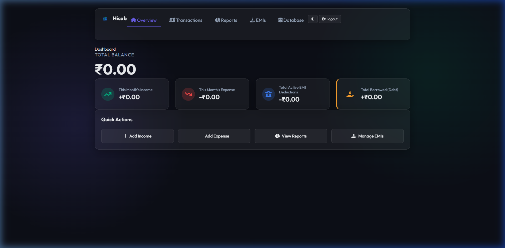
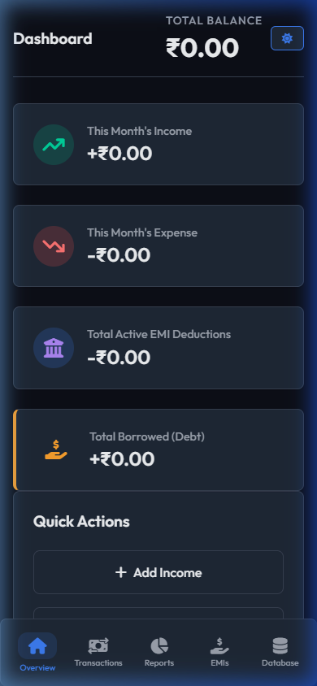
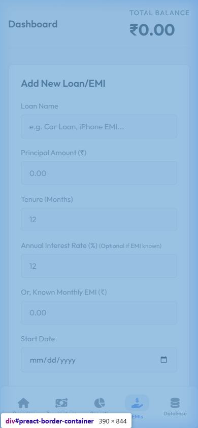

# Hisab Expense Tracker

Hisab is a modern, responsive, and secure personal finance application designed to help you track your expenses, manage your income, and monitor your EMIs. With its clean, professional interface inspired by familiar bookkeeping tools, managing your daily finances has never been clearer.

## ✨ Features

- **Dashboard Overview:** Get a quick glimpse of your total balance, recent transactions, and spending breakdowns visually using charts.
- **Transaction Ledger:** A clean, easy-to-read tabular list of all your incomes, expenses, investments, and borrowed funds.
- **EMI Tracking:** Dedicated section to track your Equated Monthly Installments, displaying principal, interest, tenure, and a visual progress bar of amount paid vs. remaining.
- **Google Sign-In:** Seamless, secure authentication using Google Identity Services (GIS).
- **Responsive Layout:** Works beautifully on desktop with a persistent sidebar, and flawlessly on mobile devices with a thumb-friendly bottom navigation bar.
- **Dark/Light Mode:** Full support for both day and night themes, togglable instantly on both desktop and mobile.
- **Admin Dashboard:** A built-in role capability allowing administrators to view global transaction volume and manage users.

## 📸 Screenshots

### Desktop Dashboard


### Mobile View (Dark Mode)


### EMI Tracking (Mobile)


## 🚀 Getting Started

Hisab is built with a pure frontend stack (HTML, CSS, vanilla JavaScript) that utilizes indexedDB for local storage, meaning it runs entirely in your browser without needing a complex backend database setup.

### Prerequisites (For Google Login)
If you wish to use the "Sign in with Google" functionality, you must run the application over a local HTTP server (Google blocks authentication from `file:///` URLs).

1. Clone the repository:
   ```bash
   git clone https://github.com/winsoheb/hisab-expense-tracker.git
   ```
2. Open the project folder in your favorite code editor (like VS Code).
3. Start a local server. If using VS Code, install the **Live Server** extension, right-click `index.html`, and select "Open with Live Server".
4. For the Google Login to work, ensure you are accessing it via `http://localhost:5500` or `http://127.0.0.1:5500`.

### Using Without Google Login (Local Testing)
If you just want to test the UI without server setup, you can temporarily bypass the login in the source code or simply use the standard Email/Password registration on the screen, which saves data directly to your browser's local IndexedDB!

## 🛠️ Technology Stack
- **HTML5:** Semantic structure.
- **CSS3:** Custom styling (no external CSS frameworks used other than FontAwesome for icons), utilizing CSS grid, flexbox, variables, and media queries for responsiveness.
- **Vanilla JavaScript:** All UI logic, theme switching, and data handling.
- **IndexedDB / LocalStorage:** Browser-native database for offline data persistence.
- **Chart.js:** For rendering the expense/income pie charts.

## 🔒 Security & Data
All your financial data is stored securely in your browser's **IndexedDB**. Nothing is sent to an external server unless you configure a backend integration.

## License
MIT License
